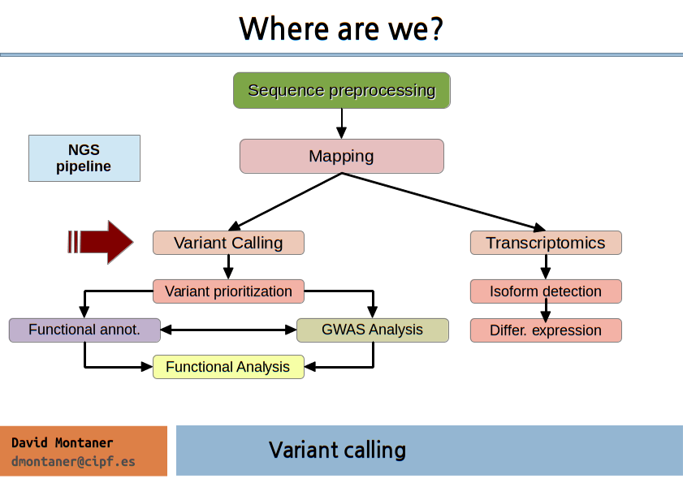
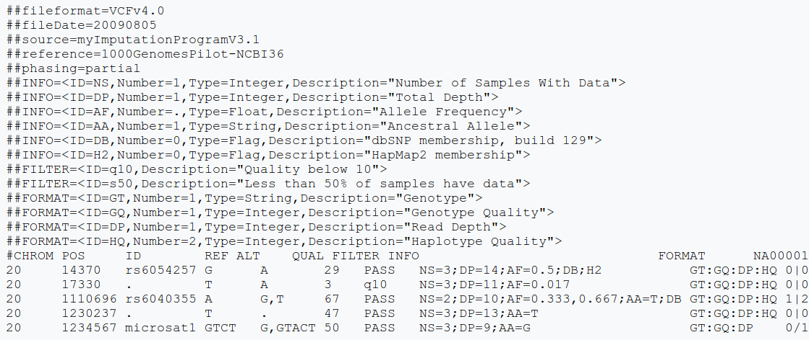
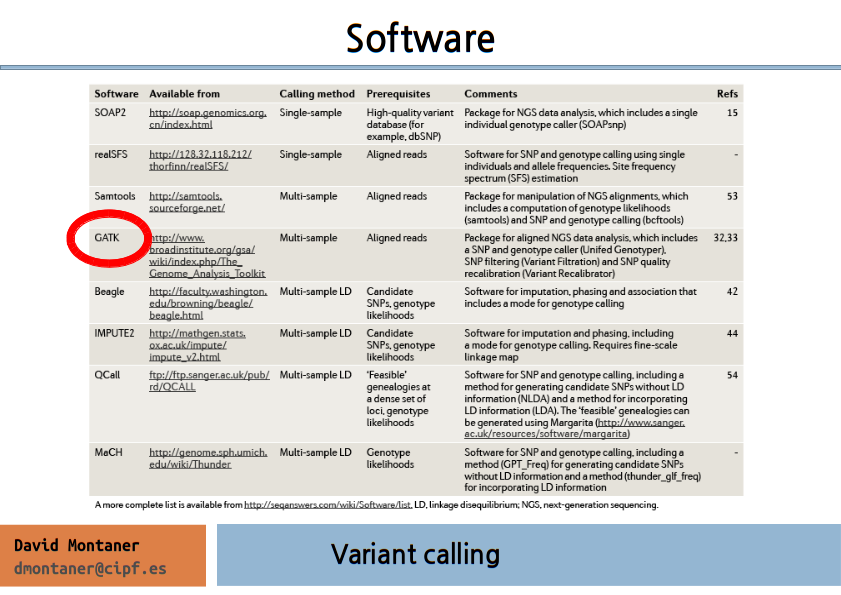
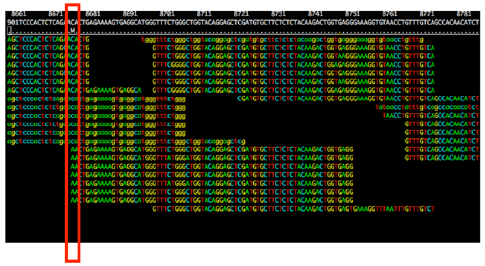
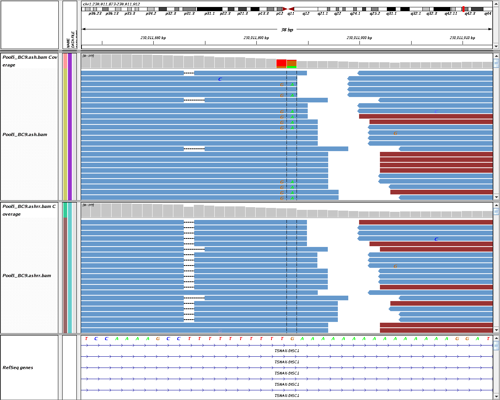

% NGS data analysis: Variant Calling
% [NGS Data Analysis Course](http://ngscourse.github.io/)
% (updated 22-11-2013)

Overview
===============================================================================

Genomic Variation
================================================================================

- SNPs / single nucleotide variants

- Structural Variants:
    + CNV: Copy number variable regions
        * Deletions
        * Duplications
    + Insertions
    + Inversions
    + Translocations
    + Inversions

File Format
================================================================================

VCF file format
===============

- CHROM: chromosome
- POS: position
- ID: name
- REF: reference base(s)
- ALT: non-reference alleles

- QUAL: quality score of the calls (phred scale)
- FILTER: PASS / filtering_tag
- INFO: additional information 

- FORMAT: describes further extra columns

VCF file format: INFO
====================

INFO column: semicolon separated fields

    <key>=<data>[,data]

Some reserved (but optional) keys:

- AA ancestral allele
- AC allele count in genotypes, for each ALT allele, in the same order as listed
- AF allele frequency
- CIGAR cigar string describing how to align an alternate allele to the reference allele
- DB dbSNP membership
- MQ RMS mapping quality, e.g. MQ=52
- MQ0 Number of MAPQ == 0 reads covering this record
- NS Number of samples with data
- SB strand bias at this position
- SOMATIC: indicates that the record is a somatic mutation
- VALIDATED validated by follow-up experiment

Software 
================================================================================

GATK Best Practices workflow
================================================================================

Mark duplicates
================================================================================

- All NGS sequencing platforms are NOT single molecule sequencing
- PCR  -> duplicate DNA fragments in the final library.
- If there is a base variation it will have high depth support
- Can result in false SNP calls

\ 

Tools

- Samtools: samtools rmdup or samtools rmdupse
- Picard/GATK: MarkDuplicates

Duplicated induce biased SNP calls
================================================================================

INDEL Realignment
================================================================================

Local realignment of all reads at a specific location simultaneously 
to minimize mismatches to the reference genome.

\ 

Reduces erroneous SNPs refines location of INDELS.

\ 

<!-- 

-->

\centerline{\includegraphics[scale=0.1]{images/variant_calling6.png}}

Base quality recalibration
================================================================================

Recalibrate base quality scores in order to correct sequencing 
errors and other experimental artifacts:

- Analyze patterns of covariation in the sequence data: 
  creates a report that will be used later.
- Generate before/after plots: 
  check the effect before you apply it to your sequence data.
- Apply the recalibration to your sequence data:
  transform your bam files.

- Requires a reference genome and a catalog of known variable sites.
- The known sites are used to build the covariation model and estimate empirical base qualities.

Calling: GATK
================================================================================

- Probabilistic method: Bayesian estimation of the most likely genotype.
- Calculates many parameters for each position of the genome.
- SNP and indel calling.
- Used in many NGS projects, including the 1000 Genomes Project, The Cancer
- Genome Atlas, etc.
- Base quality recalibration.
- Indel realignment
- Uses standard input and output files.
- Many tools for manage VCF files.
- Multi-sample calling
- <http://www.broadinstitute.org/gatk/>
